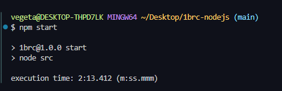

# The One Billion Row Challenge with Node.js

## My result

## [About the Challenge](https://github.com/1brc/nodejs)

A fun exploration of how quickly 1B rows from a text file can be aggregated with different languages.

## [How to Generate Rows](https://github.com/1brc/nodejs#prerequisites)

| OS Info       |                            |
| ------------- | -------------------------- |
| Processor     | Ryzen 5 2600 ~ 3 GHz       |
| Memory        | 16GB ddr4 ram 2400mhz      |
| Storage       | Kingston A400 2.5 SATA SSD |
| Graphics Card | 6500xt 4GB                 |
| OS            | windows 10 21h2            |
